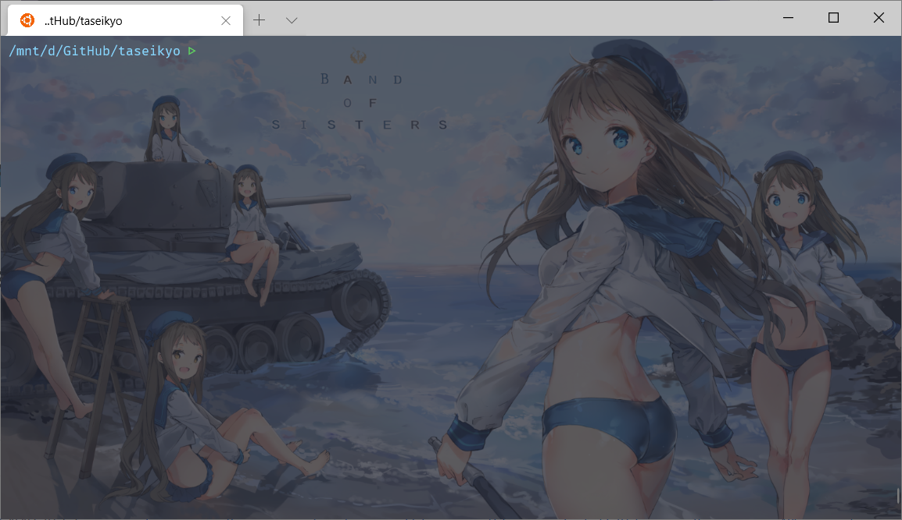

> @Date    : 2020-11-20 22:35:11
>
> @Author  : Lewis Tian (taseikyo@gmail.com)
>
> @Link    : github.com/taseikyo

<a href="#readme"></a>

@taseikyo does Simple and Stupid dotfiles!

## Table of Contents

- [myrc](#myrc)
- [git](#git)
- [sublime](#sublime)
- [terminal](#terminal)
- [vim](#vim)
- [vs code](#vs-code)

## myrc

将自定义的 alias 和环境变量提取出来放在 ".myrc" 中，这样只需要加一行 `. ~/.myrc` 在 zsh/bash/xsh 的配置文件中即可共享使用，不需要在每个 xsh 中都配置一遍，方便快捷。

使用前记得下载 remove_duplicate_cmds.py 脚本到 home 目录：

```Bash
cd ~
wget https://raw.githubusercontent.com/taseikyo/backup-utils/master/Python/00E_remove_duplicate_history_cmds.py -O remove_duplicate_cmds.py
chmod +x remove_duplicate_cmds.py
```

## git

由于常用的 git 就那么几个 add/commit/push 命令（大雾），基本的 alias 就 co/br 够用了，配置文件在 ".gitconfig"，另外还有其他的 gs/gl 在 ".myrc" 配置文件中。

## sublime

用了好多年的 sublime，现在已经完全习惯了，即使现在 vs code 有很多特性它没有，但是我还是离不开 sublime。特别是 SublimeTmpl 这个插件，"ctrl+alt+p" 新建 py 文件，"ctrl+shift+c" 新建 c++ 文件，"ctrl+shift+r" 新建 md 文件，而且配置好文件头，这个功能就很棒，相关配置文件放在 sublime 文件夹下。

## terminal

terminal 的相关配置文件在另一个 [taseikyo/oh-my-terminal](https://github.com/taseikyo/oh-my-terminal) repo，此 repo 包含 terminal+wsl2 的相关配置，就不迁移过来了，有需要直接切过去看就是。



## vim

由于 [vs code](https://code.visualstudio.com/) 可以直接连服务器了（具体配置见下面 vs code），所以 vim 的需求并不是太高，我常用的是 b 站出的一个配置：[bilibili/vim-vide](https://github.com/bilibili/vim-vide)

## vs code

vs code 主要配置在于 "Remote - SSH" 这个插件，它可以直接服务器，无论是直连节点，还是需要中间节点跳转的节点，在自己电脑上它的配置文件为 "C:/Users/taseikyo/.ssh/config"，我将其提取出来，现在是 "vscode/config"。

## license

Copyright (c) 2020 Lewis Tian. Licensed under the MIT license.
